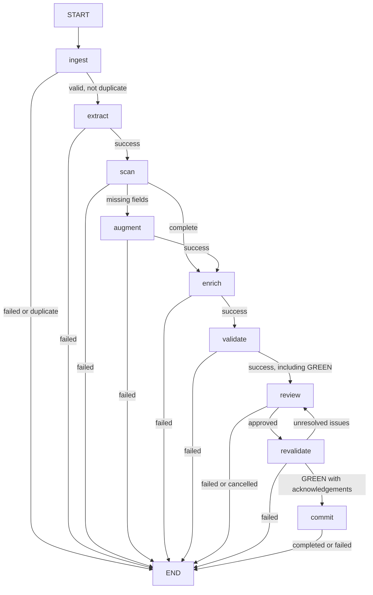

# System architecture

`src/main.py` builds the LangGraph application and invokes it once per input PDF.
The CLI validates configuration, checks Notion connectivity, scans the configured
input directory and reports successes, duplicate skips and failures separately.
There is one execution path; no legacy/parallel workflow switch is implemented.

## Graph

The editable [draw.io diagram](docs/diagrams/langgraph-state-machine.drawio)
represents the same graph. `revalidate` calls the same function as `validate`
and persists its result before routing. Confidence alone never bypasses review.
Archiving is part of commit, not a separate graph node. Nodes perform I/O and
mutate state; they are not pure functions or durable graph checkpoints.

## Components and state

| Component | Responsibility |
| --- | --- |
| `src/config.py` | Environment loading, paths, IDs, aliases and configuration validation |
| `src/domain/models/` | Pydantic receipt, enrichment, validation, review, expense and result models |
| `src/services/pdf_extractor.py` | Text extraction and deterministic merchant/date/amount parsing, optional LLM items |
| `src/llm/` | OpenAI calls, prompts, model conversion and keyword fallback |
| `src/services/ui.py` | Interactive corrections, acknowledgements, payer and split selection |
| `src/services/notion_api.py` | Expense/split creation, receipt upload and relation linking |
| `src/services/notion_retry.py` | Bounded retry policy for eligible Notion operations |
| `src/services/submission_journal.py` | Durable operation IDs, uncertainty tracking, identity and local locking |
| `src/services/file_organizer.py` | Destination planning and file moves |
| `src/workflows/langgraph/graph.py` | Node registration and routing |

`ReceiptWorkflowState` is a TypedDict containing Pydantic values. `workflow_input`
holds source, file path and raw text; there are no top-level `file_path` or
`raw_text` fields. The extraction model is in `domain/models/recipts.py` (the
existing spelling), with line items in `receipt_item.py`.

State carries `status`, `receipt`, `scan_results`, `augment_results`,
`enriched_receipt`, `validation_result`, `acknowledged_warnings`, `review_data`,
`expense_summary`, `results` and `failure_reason`. Optional `duplicate_expense_id`,
`submission_id` and `submission_token` support duplicate reporting and recovery.
The status enum is one field in this state, not the state itself.

## Processing behavior

1. **Ingest:** validate input, check journal identity, then extract PDF text into
   `workflow_input.raw_text`. Completed duplicates terminate before extraction/review.
2. **Extract:** parse a receipt with LLM item extraction enabled. Missing or
   nonpositive amounts fail here; missing dates can proceed to scan.
3. **Scan/augment:** inspect required fields and, if missing, attempt LLM recovery
   from raw text. Unfilled values remain available for validation/review.
4. **Enrich:** categorize using OpenAI; failures fall back to keyword matching at
   confidence 0.5. Vendor `Unknown` skips enrichment.
5. **Validate/review/revalidate:** RED findings require correction or explicit
   override, YELLOW findings require acknowledgement. Review collects approved
   output and updates the receipt. Revalidation persists fresh findings; all
   issue keys must be resolved or acknowledged before commit.
6. **Commit:** journal expense creation, split creation and relation linking;
   archive only after those operations succeed. Return Notion IDs and archive
   path in `WorkflowResults`, or FAILED with a reason.

Split titles use `services/split_titles.py` for preview and submission. The
nonpayer's share is stored as a percentage; the Notion schema supplies rollups.
File organization uses `processed/YYYY/MMM/vendor/`, with sanitized filenames and
collision handling.

## Persistence and failure boundaries

Failures terminate the graph rather than entering a separate failure node.
Cancellation/declined confirmation is represented as FAILED. `main.py` also catches
unexpected invocation errors. A completed graph result is not a durable checkpoint:
the SQLite journal records submission operations, not all graph state.

Identity is PDF SHA-256 plus environment and target expense/split database IDs.
The journal preserves approved payloads and known Notion IDs; uncertain page
creation blocks automatic recreation. Locking coordinates processes using the
same local journal only. Historical/manual Notion entries and re-encoded PDFs are
outside this duplicate protection. See [submission recovery](docs/SUBMISSION_RECOVERY.md)
for reconciliation and the distinction between full CLI duplicate skips and
direct commit archive recovery.

`QA_SKIP_COMMIT` returns synthetic completion results without writes/moves, but
CLI connectivity checks and possible LLM calls remain. Configuration loading and
commands are documented in the [README](README.md).

## External services and verification

PDF parsing and journal storage are local. OpenAI can receive raw receipt text,
items and metadata; Notion receives approved expense/split data and best-effort
receipt uploads. A missing LLM key does not disable deterministic parsing or
human review. See [LLM behavior](src/llm/README.md).

[Verification results](docs/WORKFLOW_VERIFICATION.md) map unit/integration tests to
actual behavior. Those tests mock Notion and LLM calls, use temporary journal and
archive paths, and reuse representative PDF fixtures. Live QA is tracked in #57.
Gmail ingestion, folder watching and trigger orchestration are deferred under #25;
a source enum value does not implement a trigger.
